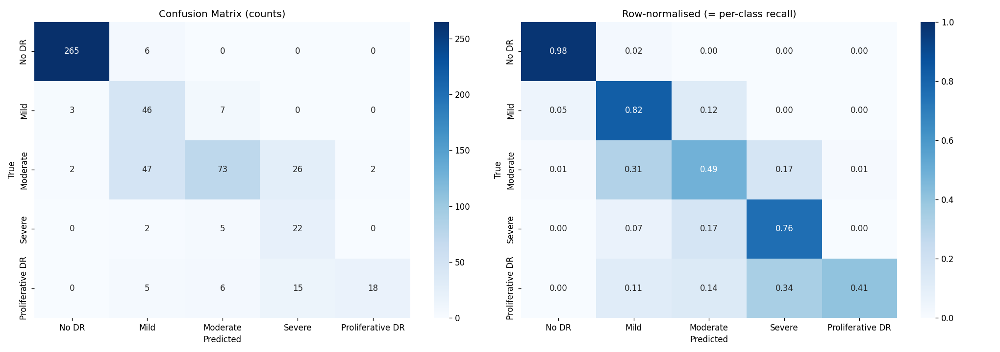

[](https://huggingface.co/spaces/suhanii23/retinopathy-detector)
[](https://www.kaggle.com/code/qipchip31/diabetic-retinopathy-evaluation)

# 👁️ Diabetic Retinopathy Detector

An AI-powered tool for detecting and classifying diabetic retinopathy from retinal fundus images into five severity stages.

🔗 **Live Demo (HuggingFace Spaces)**
https://huggingface.co/spaces/suhanii23/retinopathy-detector

📓 **Evaluation Notebook (Kaggle)**
https://www.kaggle.com/code/qipchip31/diabetic-retinopathy-evaluation

---

## Model

The trained model is not included in this repository. The deployed app downloads it at
runtime from the [`suhanii23/retinopathy-model`](https://huggingface.co/suhanii23/retinopathy-model)
HuggingFace Hub repo (`diabetic_retinopathy_model.keras`).

---

## What is Diabetic Retinopathy?

Diabetic retinopathy is a diabetes complication that affects the eyes, caused by damage to the blood vessels in the retina. It is one of the leading causes of blindness worldwide. Early detection is critical — this tool aims to assist in screening by automatically classifying retinal images into five severity stages.

| Stage         | Description                                          |
| ------------- | ---------------------------------------------------- |
| No DR         | No signs of diabetic retinopathy                     |
| Mild          | Early stage with microaneurysms                      |
| Moderate      | More severe, with blocked blood vessels              |
| Severe        | Many blood vessels blocked                           |
| Proliferative | Advanced stage with abnormal new blood vessel growth |

---

## Results

Measured against the exact validation split (`test_size=0.15, random_state=2006,
stratified` — 550 images, 29 of them Severe), reproduced deterministically from the
same seed used during training.

| Metric                          | Value                          |
| -------------------------------- | ------------------------------ |
| Quadratic Weighted Kappa (QWK)    | **0.883**                      |
| Validation Accuracy              | 77.1%                          |
| Validation Set Size              | 550 images                     |
| Dataset                          | APTOS 2019 Blindness Detection |
| Model                            | Xception (Transfer Learning)   |

### Why QWK, not accuracy, is the headline metric

The five DR grades are **ordinal**, not categorical — mistaking No DR for
Proliferative is a far more serious error than mistaking Mild for Moderate. QWK
penalizes disagreements by `(i - j)²`, the squared distance between predicted and
true grade, so it captures this directly; plain accuracy treats every misclassification
as equally bad regardless of distance.

Accuracy is also misleading on this class distribution: **49% of the validation set
is No DR**, so a trivial majority-class predictor scores roughly 49% accuracy while
being clinically useless. QWK is chance-corrected — that same majority-class
predictor scores close to **0** — which is why it's the official APTOS competition
metric and the more honest headline number here.

### Per-Class Performance

| Class         | Support | Precision | Recall | F1-Score |
| ------------- | ------- | --------- | ------ | -------- |
| No DR         | 271     | 0.981     | 0.978  | 0.980    |
| Mild          | 56      | 0.434     | 0.821  | 0.568    |
| Moderate      | 150     | 0.802     | 0.487  | 0.606    |
| Severe        | 29      | 0.349     | 0.759  | 0.478    |
| Proliferative | 44      | 0.900     | 0.409  | 0.563    |

Mild and Severe both show high recall paired with low precision — the expected
signature of balanced class weighting pulling the decision boundary toward the
minority classes. The model over-predicts these classes relative to their true
frequency, catching most true Mild/Severe cases but at the cost of also mislabeling
some adjacent-grade cases as Mild/Severe.



### Error Structure

| Distance from true grade | Count |
| ------------------------- | ----- |
| 1 grade                   | 109   |
| 2 grades                  | 12    |
| 3 grades                  | 5     |
| 4 grades                  | 0     |

Mean error distance: **1.17** grades. **86.5%** of all misclassifications (109 of
126) are off by only one grade, and **zero** predictions across all 550 images are
off by the maximum possible distance of four grades — no catastrophic
misclassification occurred. This is exactly why QWK (0.883) comes out well above raw
accuracy (0.771): QWK rewards the fact that when the model is wrong, it's usually
only slightly wrong.

The largest individual confusions are Moderate→Mild (47 cases), Moderate→Severe (26),
and Proliferative→Severe (15) — all adjacent-grade errors.

### Referable DR (screening threshold: Moderate or worse)

| Metric      | Value |
| ----------- | ----- |
| Sensitivity | 0.749 |
| Specificity | 0.979 |

This operating point is tuned the wrong way for a screening tool: a missed referral
(false negative) costs far more than an unnecessary one (false positive), since a
missed referral can mean a patient with sight-threatening disease goes unseen.
Specificity is at 0.979 — there is substantial headroom to trade some of it away.
**Lowering the referral decision threshold is the clearest next improvement, and it
requires no retraining** — only a change to where the argmax/threshold cutoff is
applied at inference time.

---

## Model Details

* **Architecture:** Xception (ImageNet) + GlobalAveragePooling2D + Dropout(0.5) + Dense(2048, relu) + Dropout(0.5) + Dense(5, softmax)
* **Input:** 299×299 retinal fundus images
* **Output:** 5-class ordinal prediction (No DR → Proliferative)
* **Training Dataset:** APTOS 2019 Blindness Detection (3,662 images)
* **Split:** `train_test_split(test_size=0.15, random_state=2006, stratify=y)` → 550 validation images
* **Training Platform:** Kaggle (P100 GPU)
* **Framework:** TensorFlow / Keras

---

### Training Strategy

**Phase 1 — Warmup (2 epochs)**

* Backbone frozen, only the classification head trained
* Learning rate: 1e-3

**Phase 2 — Fine-tuning (up to 20 epochs)**

* Backbone unfrozen (BatchNorm layers kept frozen — see `model.py`)
* Learning rate: 1e-4
* Batch size: 16, balanced class weights
* Callbacks (all monitoring `val_loss`): `ModelCheckpoint`, `ReduceLROnPlateau(patience=3, factor=0.5)`, `EarlyStopping(patience=8)`

### Augmentation

`rotation_range=360`, horizontal + vertical flip, `zoom_range=[0.98, 1.02]`, `width_shift_range=0.01`, `height_shift_range=0.01`. Validation data is not augmented. A fundus image has no canonical orientation, so full rotation and both flips are label-preserving. Brightness/contrast jitter is deliberately excluded — it would partially undo the Ben Graham illumination normalization below.

---

## Preprocessing

Ben Graham's preprocessing method is applied to all images, implemented once in `preprocess.py` and shared by both training and serving code:

1. Crop black borders from retinal images
2. Resize to 299×299
3. Apply Gaussian blur subtraction (`4*I - 4*blur(I) + 128`) to suppress low-frequency content (illumination, colour cast) and enhance vessels, microaneurysms, exudates and haemorrhages
4. Normalize via `tensorflow.keras.applications.xception.preprocess_input`, which scales pixels to **[-1, 1]** — the range Xception was pretrained on

```python
def preprocess_image(image_path, sigma_x=SIGMA_X):
    image = cv2.imread(image_path)
    image = cv2.cvtColor(image, cv2.COLOR_BGR2RGB)
    image = crop_image_from_gray(image)
    image = cv2.resize(image, (IMAGE_SIZE, IMAGE_SIZE))
    image = cv2.addWeighted(image, 4, cv2.GaussianBlur(image, (0, 0), sigma_x), -4, 128)
    return preprocess_input(image.astype(np.float32))
```

---

## Project Structure

```
retinopathy-detector/
├── app.py                  # Gradio inference app (deployed to HF Spaces)
├── preprocess.py           # Shared preprocessing — imported by train.py AND app.py
├── model.py                # Model architecture + backbone freeze/unfreeze
├── train.py                # Two-phase training CLI
├── evaluate.py             # Evaluation CLI (metrics, confusion matrix, curves)
├── requirements.txt        # Inference-only dependencies
├── requirements-dev.txt    # Training/evaluation dependencies
├── notebooks/
│   └── diabetic-retinopathy-evaluation.ipynb
├── assets/
│   ├── confusion_matrix.png
│   └── validation_predictions.png
└── README.md
```

`preprocess.py` is imported by both `train.py` and `app.py` rather than duplicated in
each. This makes training/serving skew structurally impossible: there is exactly one
implementation of the transform, so the pipeline applied at inference cannot silently
drift from the one used during training.

---

## How to Use

### Running Locally

```
git clone https://github.com/suhanii-23/retinopathy-detector
cd retinopathy-detector
pip install -r requirements.txt
python app.py
```

### Training

```
pip install -r requirements-dev.txt
python train.py --data-dir /path/to/aptos2019 --output /path/to/output
python evaluate.py --model /path/to/output/diabetic_retinopathy_model.keras \
    --val-split /path/to/output/val_split.npz --history /path/to/output/history.json
```

---

## Reproducing the Results

The validation split is deterministic — `train_test_split(test_size=0.15,
random_state=2006, stratify=y)` on the same dataframe always yields the same 550
images, so the numbers above can be regenerated exactly rather than re-estimated.

* 📓 [**Evaluation notebook on Kaggle**](https://www.kaggle.com/code/qipchip31/diabetic-retinopathy-evaluation) — runnable end to end, with full outputs
* [`notebooks/diabetic-retinopathy-evaluation.ipynb`](notebooks/diabetic-retinopathy-evaluation.ipynb) — the same notebook, committed with outputs
* [`evaluate.py`](evaluate.py) — script version

The notebook pulls the deployed model directly from the HuggingFace Hub, so it
measures the exact artifact being served rather than a locally retrained copy.

---

## Limitations

* **Referable-DR sensitivity (0.749) is too low for a screening tool** — roughly one
  in four patients who need referral would be missed at the current decision
  threshold; see [Referable DR](#referable-dr-screening-threshold-moderate-or-worse) above
* **Moderate recall is 0.487** — Moderate→Mild is the single largest confusion (47
  cases), the dominant failure mode in the model
* **Proliferative recall is 0.409** — the model misses more than half of true
  Proliferative cases
* **Only 29 Severe images in validation** — per-class metrics for Severe are based on
  a small sample and should be treated as a rough estimate, not a precise one
* **Single split, not cross-validated** — results come from one 550-image validation
  set rather than an average over multiple folds, so they carry the variance of a
  single sample
* **Same validation set used for both early stopping and final reporting** — the 550
  validation images are used both to early-stop training and to report the metrics
  above, which introduces a mild optimistic bias. A held-out test set never seen
  during model selection would give a more honest estimate.
* **Not for clinical use** — this is an educational project, not a medical device
* **Image quality dependency** — performance degrades on low-quality or non-standard fundus images

---

## Future Work

* **Tune the referral threshold** to trade surplus specificity (0.979) for
  sensitivity — the highest-value change available, and it requires no retraining
* Reframe as **ordinal regression** with learned thresholds rather than plain 5-class
  softmax, so the model is rewarded for adjacent predictions instead of only the
  metric knowing the grades are ordered
* **Focal loss** to stop spending model capacity on the easy No DR cases
* Add **Grad-CAM** heatmap overlays to show which retinal regions influenced the
  prediction — both for interpretability and to verify the model attends to
  pathology rather than acquisition artefacts
* Address class imbalance further with oversampling on minority classes
* Experiment with ensemble models such as Xception + EfficientNet
* Collect or augment more Severe and Proliferative samples
* Hold out a separate test set, independent of the validation split used for early stopping

---

## Disclaimer

⚠️ This tool is for **educational purposes only**.
It is **not intended for clinical diagnosis**. Always consult a qualified ophthalmologist for medical evaluation.

---

## Acknowledgements

* Dataset: [APTOS 2019 Blindness Detection](https://www.kaggle.com/c/aptos2019-blindness-detection) (Kaggle)
* Preprocessing: Ben Graham's retinal preprocessing method
* Base architecture: [Xception](https://arxiv.org/abs/1610.02357) (Chollet, 2017)
